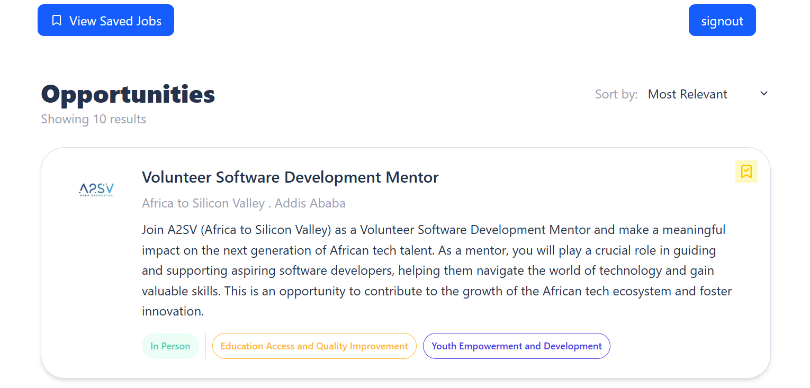
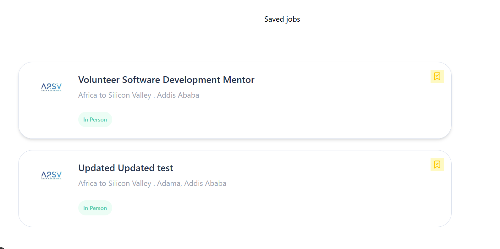
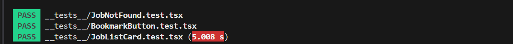
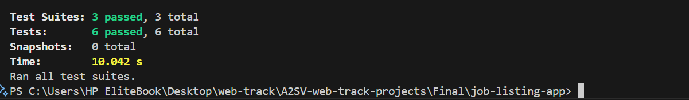
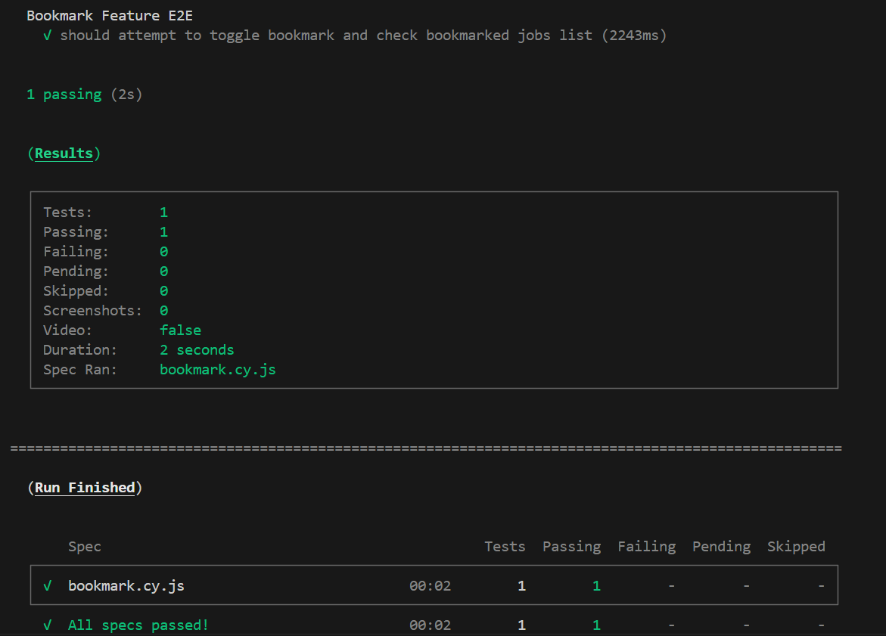

📌 Next.js + TypeScript Job Listing Dashboard — Final Task: Bookmark Functionality

This is the Final Task for the Job Listing Dashboard built with Next.js, TypeScript, and Tailwind CSS.
In this update, we added bookmark functionality so users can save their favorite job positions and access them later.

✅ Features
🔖 Bookmark Toggle Button — Each job card now includes a button to bookmark or unbookmark a job.

🔒 Authenticated Access — Bookmark functionality is available only for logged-in users.

📡 Live API Integration — Bookmark actions are synced with the backend via REST API.

📜 Bookmarked List View — Users can view all saved jobs in one place.

🧾 Detailed Job Info — Job detail pages remain accessible with full descriptions.

⚙️ Technologies Used
⚛️ Next.js (App Router)

🛠️ TypeScript

💨 Tailwind CSS

📡 Redux Toolkit Query (RTK Query)

🔐 JWT Authentication

🧪 Jest for unit and component testing

🌐 Cypress for end-to-end testing

🔖 Bookmark API Integration

▶️ Getting Started
🧩 Prerequisites
Node.js and npm

Git

Backend API access (Base URL: https://akil-backend.onrender.com/)

🚀 Run the Project Locally

# Clone the repo

git clone https://github.com/sosena2/A2SV-web-track-projects.git

# Navigate into the folder

cd final-task/job-listing-app

# Install dependencies

npm install

# Start the development server

npm run dev
Visit the app at: http://localhost:3000

🔗 API Endpoints Used
Base URL: https://akil-backend.onrender.com/

🧪 Testing
Unit & Component Testing (Jest)
✅ Tested bookmark toggle logic.

✅ Ensured button state updates correctly.

✅ Verified job card renders correctly.

✅ Checked "Job Not Found" card rendering.

End-to-End Testing (Cypress)
✅ Tested bookmarking a job from the listing page.

✅ Verified that bookmarked jobs appear in the bookmarks list.

✅ Tested unbookmarking functionality.

📸 Screenshots
🏠 Home Page (Job Listings with Bookmark Button)

🔖 Bookmarked Jobs Page

Jest test results

cypress test results

