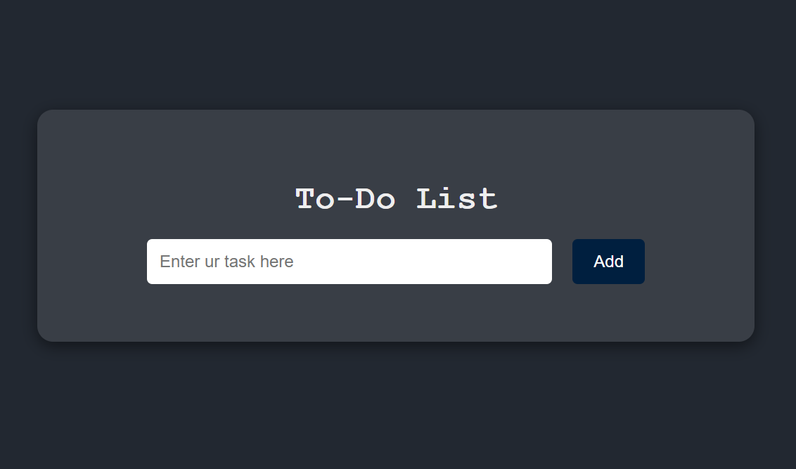
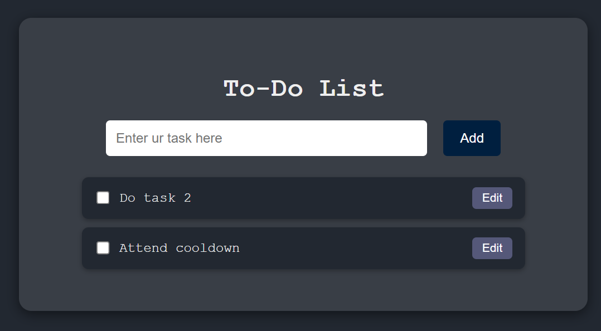
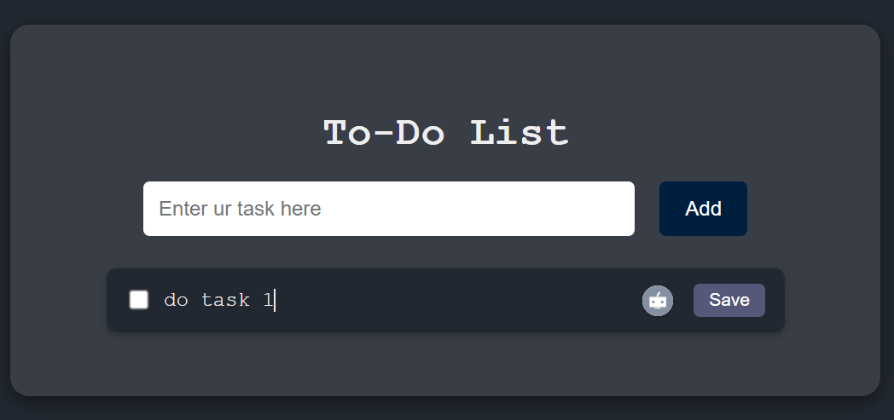
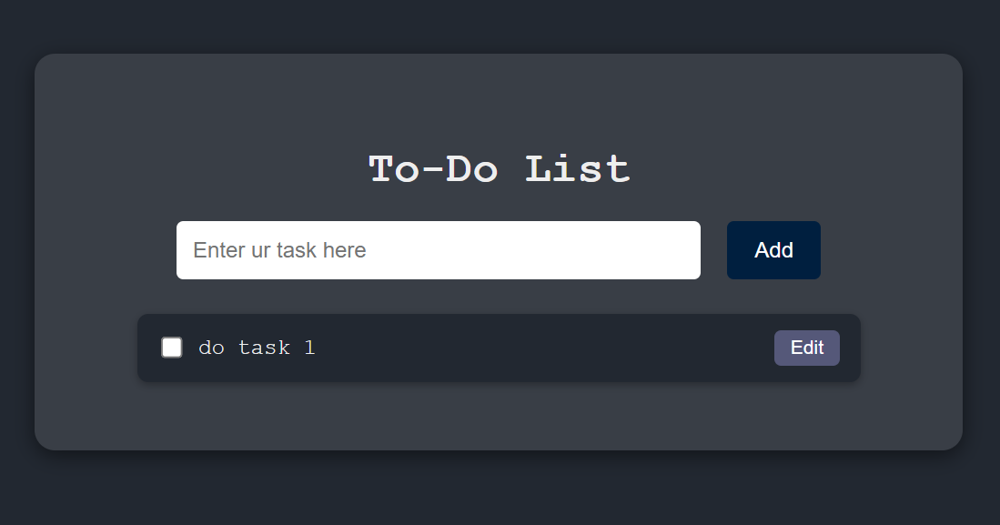

# A2SV-web-track-projects

This is a simple web-based **Todo List App** built using **HTML, CSS, and JavaScript**.

Users can:

- ➕ Add new tasks
- ✏️ Edit tasks inline
- ❌ Delete tasks using a checkbox
- 💾 Save all tasks using `localStorage` so they persist on refresh

## ▶️ How to Run This Project

1. Clone the repo:

   ```bash
   git clone https://github.com/sosena2/A2SV-web-track-projects

   ```

2. Navigate to the project folder:
   cd task-1

3. Open the app:
   - Open index.html in your browser
   - Or use Live Server in VS Code

📸 Screenshots

🏠 Main Page

This is the main interface of the app where you can add tasks.


➕ Add Task


Shows a new task being added to the list.

✏️ Edit Task

Shows how you can edit a specific task by clicking the "Edit" button, editing in-place, and clicking "Save".

❌ Delete Task

A task can be removed by checking its checkbox. This deletes it from the page and localStorage.
