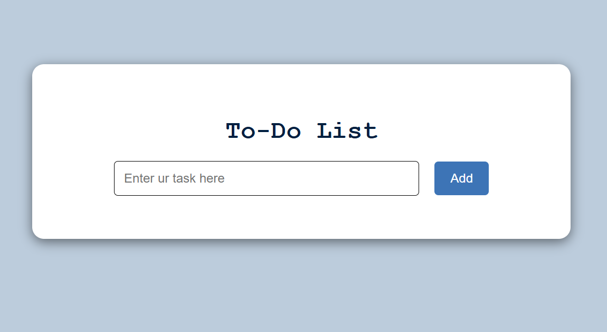
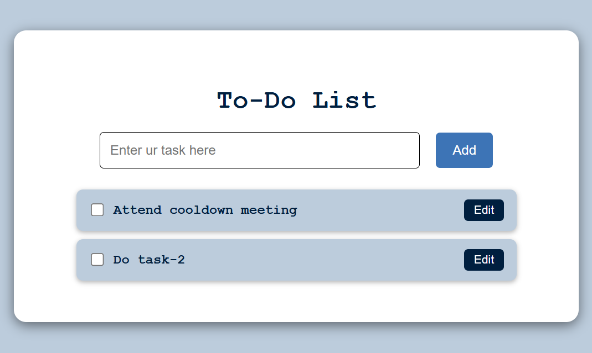
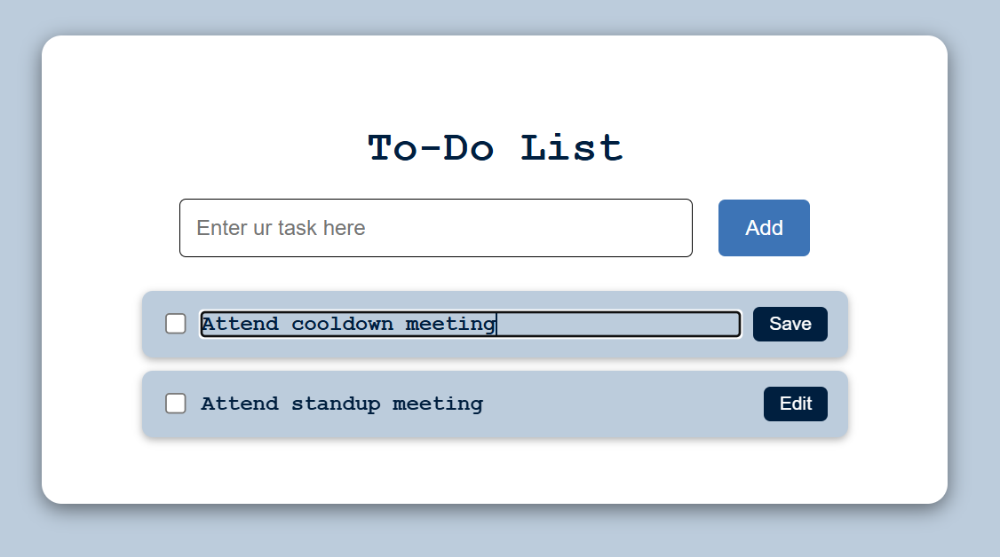
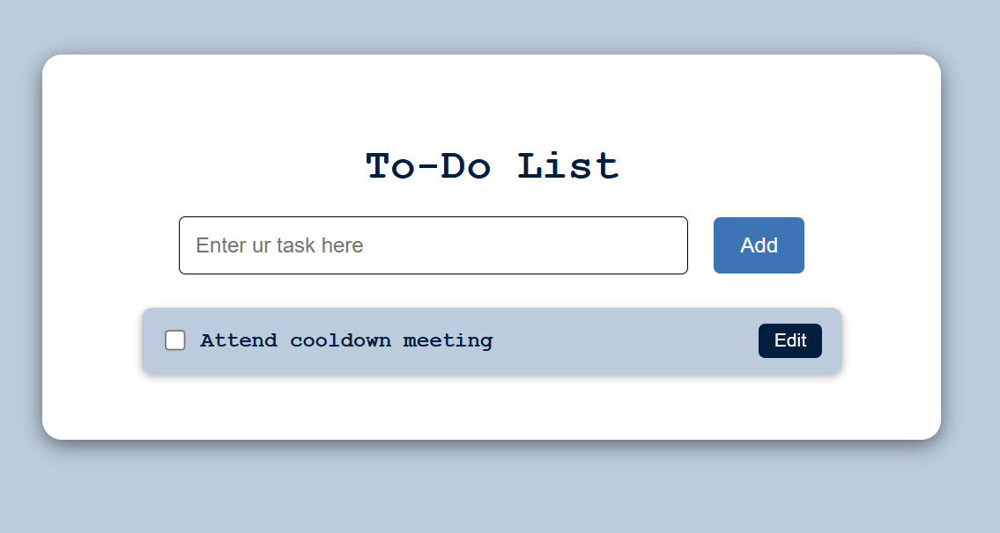

# 📝 TypeScript Todo List App

This is a simple, interactive Todo List App built with **TypeScript**, **HTML**, and **CSS**.

---

## ✅ Features

- ➕ **Add new tasks**
- ✏️ **Edit tasks inline**
- ❌ **Delete tasks** using a checkbox
- 💾 **Persist tasks** in `localStorage` (your list stays after refresh)

---

## ▶️ How to Run This Project

### 🧩 Prerequisites

Make sure you have the following installed:

- [Node.js & npm](https://nodejs.org/)
- TypeScript globally:
  ```bash
  npm install -g typescript
  ```

🚀 Steps to Run
Clone the repository

git clone https://github.com/sosena2/A2SV-web-track-projects/

Navigate to the project folder

cd A2SV-web-track-projects/task-2

Compile the TypeScript

npx tsc
This compiles src/todo.ts into dist/todo.js.

Open the App

Open index.html in your browser
OR
Use the Live Server extension in VS Code

📸 Screenshots
🏠 Main Page :
This is the main interface of the app where you can view, add, and manage tasks.


➕ Add Task :
A user can enter a task and click "Add" to include it in the list.


✏️ Edit Task :
Click the "Edit" button next to a task to modify it, then "Save" to update.


❌ Delete Task :
Check the checkbox to delete a task. It will be removed from the page and localStorage.

