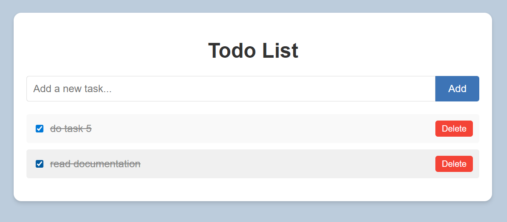
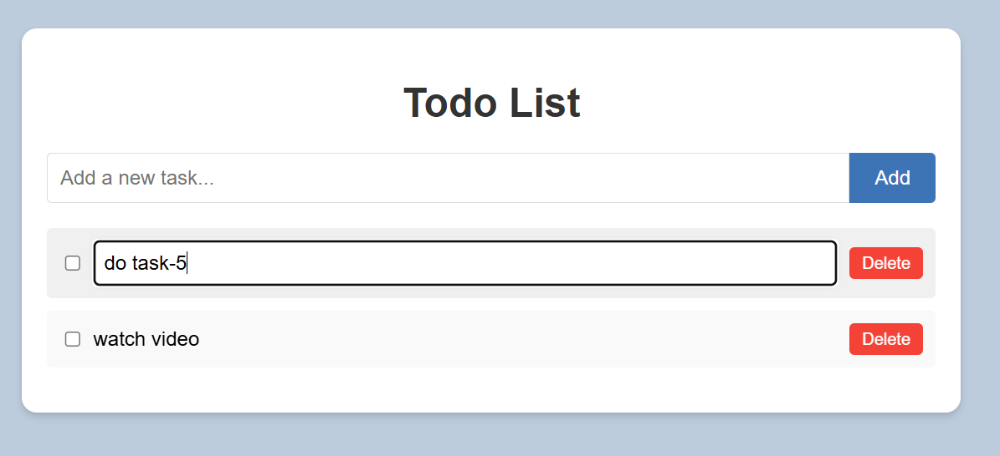
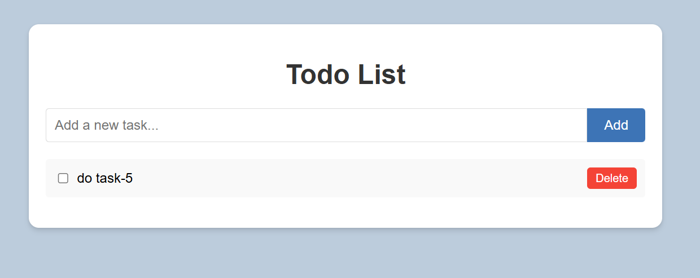

📝 React + TypeScript Todo List App
This is a simple, interactive Todo List built using React, TypeScript, and CSS. It demonstrates the use of components, React Hooks, and localStorage for persistent state.

✅ Features
➕ Add Tasks — Quickly add new items to your list

✏️ Edit Tasks — Modify existing tasks directly

✅ Mark as Done — Check off completed tasks

❌ Delete Tasks — Remove items from the list

💾 Persistent State — Tasks are saved in localStorage and remain after a page refresh

⚙️ Technologies Used
🧠 React (with Hooks)

🛠️ TypeScript

🎨 CSS (vanilla)

🌐 Browser localStorage API

▶️ Getting Started
🧩 Prerequisites
Node.js and npm

Git

🚀 Run the Project Locally
Clone the repo

git clone https://github.com/your-username/your-repo-name

Navigate into the folder

cd your-repo-name

Install dependencies

npm install
Start the development server

This will open the app in your default browser at http://localhost:3000

📸 Screenshots
🏠 Main Page

Manage your tasks in one place.

➕ Add a Task

Type and hit Add to include it.

✅ Mark as completed

check the checkbox to mark task as completed

✏️ Edit a Task

Click Edit, make changes, then Save.

❌ Delete a Task

Remove tasks permanently.
