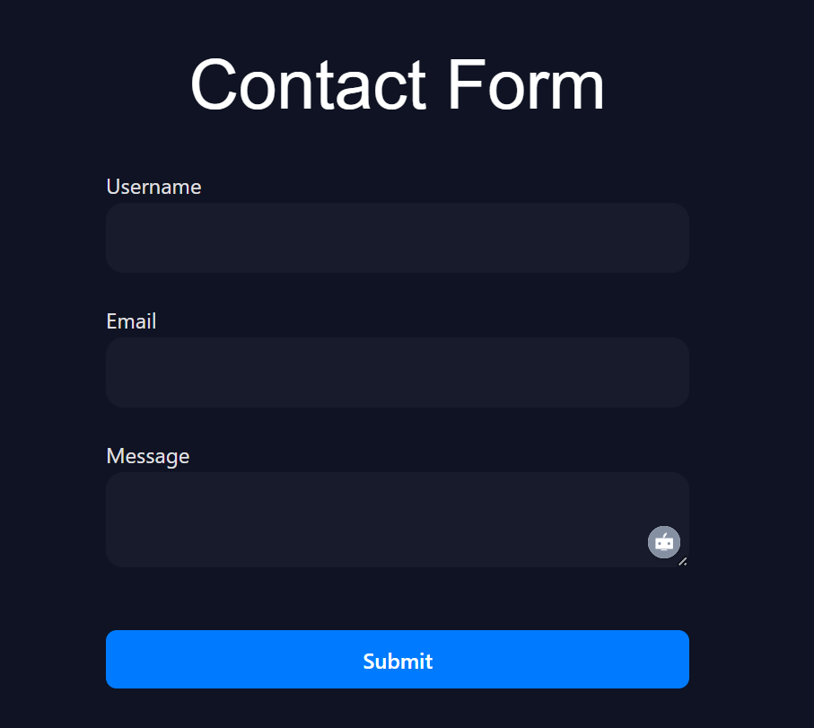
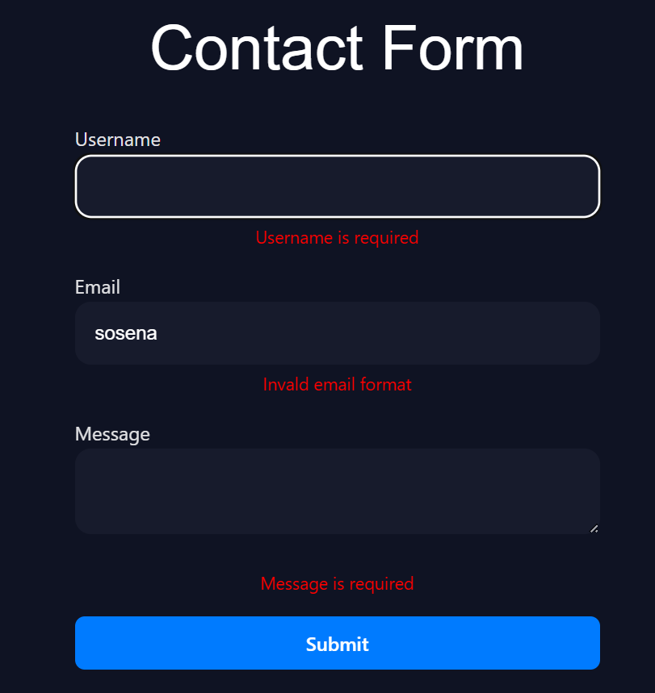
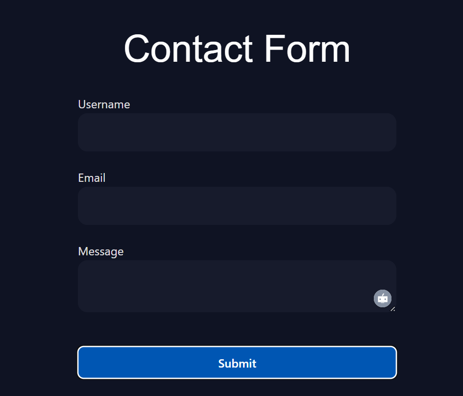

# 📝 React + TypeScript Contact Form

This is a simple and responsive Contact Form built using **React**, **TypeScript**, and **React Hook Form**. It includes real-time validation, error messages, and form reset functionality.

---

## ✅ Features

📨 **Input Fields** — Users can submit their Name, Email, and a Message  
🛡️ **Validation** — Ensures all fields are filled, with proper email format  
❗ **Error Messages** — User-friendly validation error feedback  
🔁 **Form Reset** — Automatically clears the form after successful submission  
🧪 **DevTool** — Visual debugging using `@hookform/devtools` (dev only)

---

## ⚙️ Technologies Used

- ⚛️ React (with Hooks)
- 🛠️ TypeScript
- 🎯 React Hook Form
- 🎨 CSS (vanilla)

---

## ▶️ Getting Started

### 🧩 Prerequisites

- Node.js and npm
- Git

### 🚀 Run the Project Locally

1. Clone the repo

   ```bash
   git clone https://github.com/sosena2/A2SV-web-track-projects/tree/main/task-5

   ```

2. Navigate into the folder
   cd contact-form-app

3. Install dependencies
   npm install

4. Start the development server
   npm run dev
   The app will open in your default browser at http://localhost:3000

📸 Screenshots

🏠 Form Interface


Simple and clean UI with input fields.

❗ Validation Error


Shows error when a required field is missing or email is invalid.

✅ Successful Submission


Form clears on successful submission.
