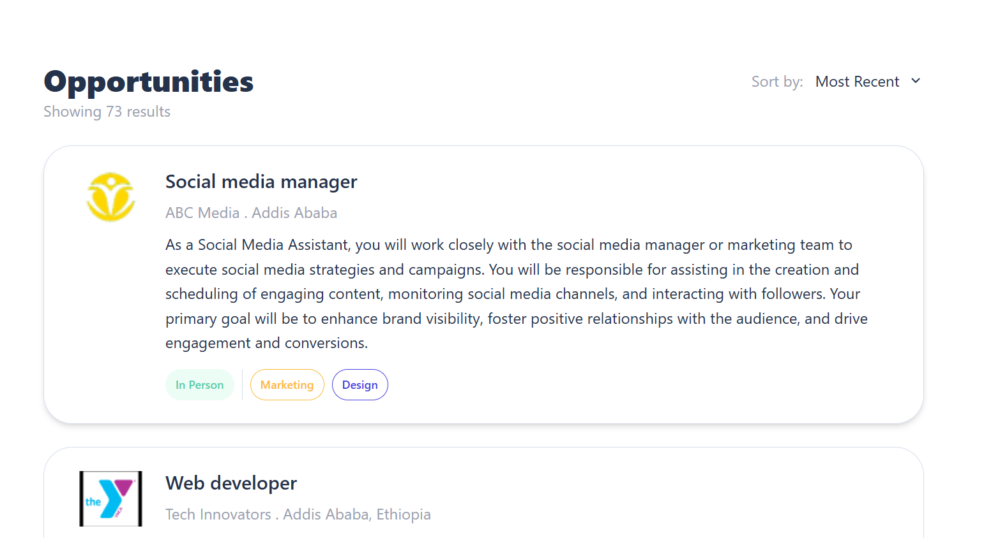
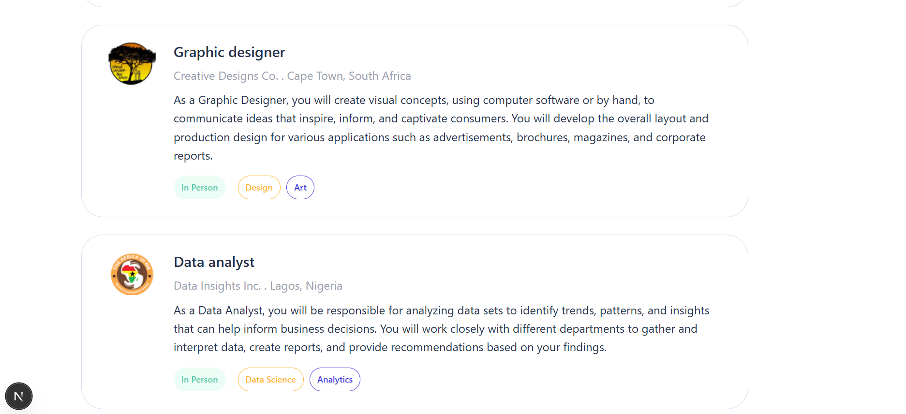
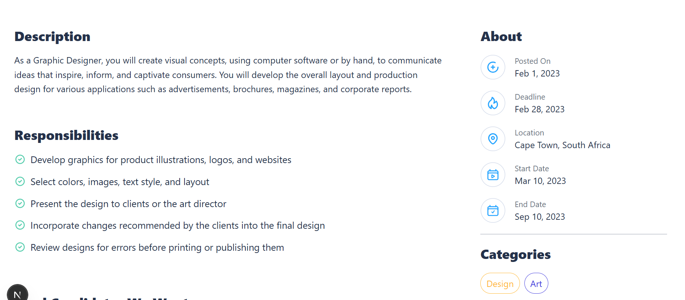

# 📝 Next.js + TypeScript Job Listing Dashboard

This is a Job Listing Dashboard built using **Next.js**, **TypeScript**, and **Tailwind CSS**. It displays job cards dynamically using dummy data and includes company avatars, job descriptions, and a clean layout..

✅ Features
📄 Job Cards — Displays job title, company, location, job type, avatar, and posted time
🖼️ Avatar Image — Each job includes a company logo/avatar
📦 Dummy Data — Populates all job cards from a local data file
🧾 Job Descriptions — Separate section for detailed job info

⚙️ Technologies Used

⚛️ Next.js (App Router)
🛠️ TypeScript
💨 Tailwind CSS
🖼️ Static Image Assets (Avatar)

▶️ Getting Started
🧩 Prerequisites

- Node.js and npm
- Git

🚀 Run the Project Locally

- Clone the repo
  git clone https://github.com/sosena2/A2SV-web-track-projects/tree/main/task-6

- Navigate into the folder
  cd job-listing-app

- Install dependencies
  npm install

- Start the development server
  npm run dev
  The app will open at: http://localhost:3000

📸 Screenshots

🏠 Home page

🧾 Dashboard

📱 Mobile Responsive
