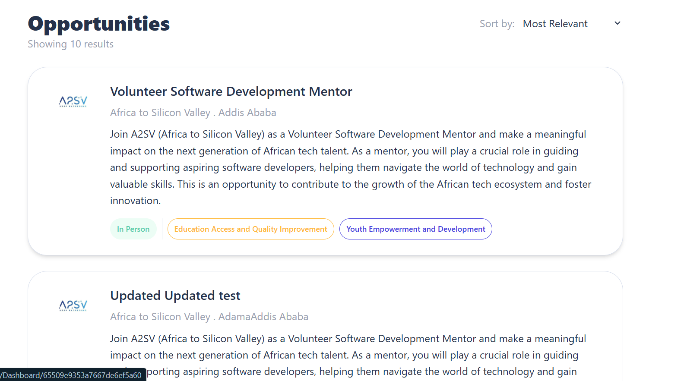
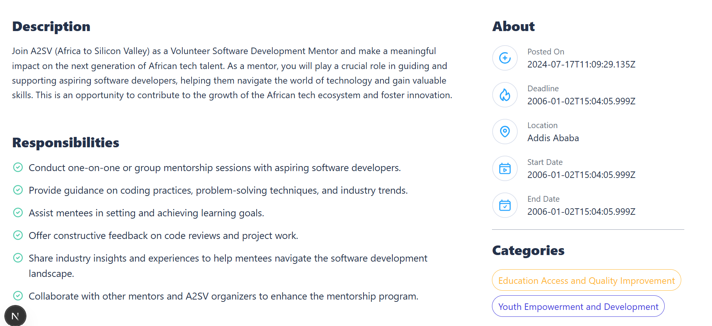
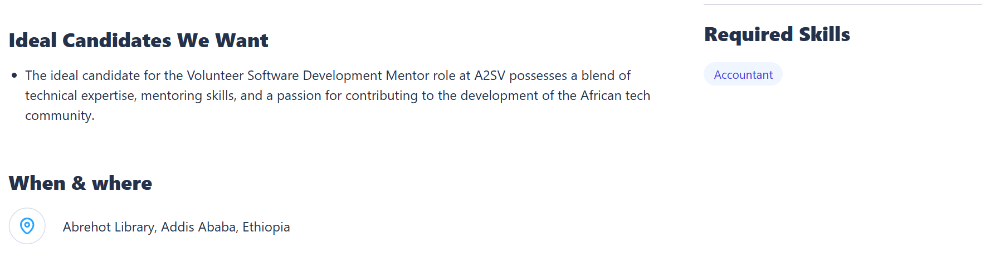
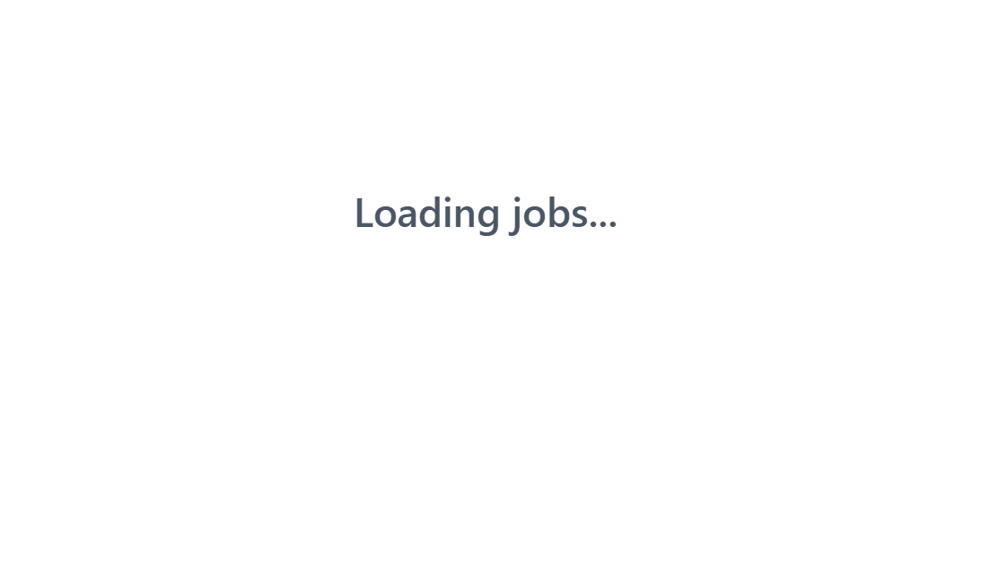
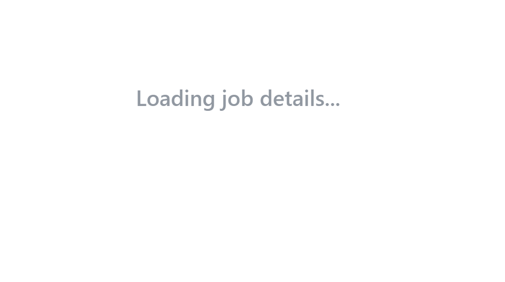
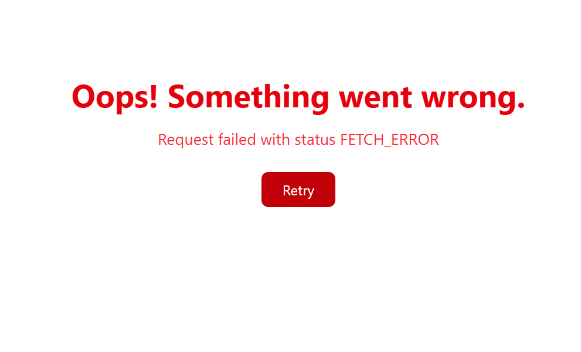

# 📝 Next.js + TypeScript Job Listing Dashboard — Task 7

This is a Job Listing Dashboard built with **Next.js**, **TypeScript**, and **Tailwind CSS**. In this task, we extended the functionality by **integrating live job data** from a provided **API endpoint** instead of using dummy data.

---

## ✅ Features

- 📄 **Dynamic Job Cards** — Each card displays job title, company, location, job type, avatar/logo, and posted time.
- 🌐 **Live API Integration** — Fetches data from a remote backend and displays in real time.
- 🖼️ **Company Logos** — Displays logo per company from the API.
- 🧾 **Detailed Descriptions** — Job detail page shows full info by job ID.
- ⚠️ **Error Handling** — Graceful handling of failed requests or invalid data.

---

## ⚙️ Technologies Used

- ⚛️ **Next.js (App Router)**
- 🛠️ **TypeScript**
- 💨 **Tailwind CSS**
- 📡 **Redux Toolkit Query (RTK Query)**
- 🌐 **REST API Integration**

---

## ▶️ Getting Started

### 🧩 Prerequisites

- Node.js and npm
- Git

### 🚀 Run the Project Locally

```bash
# Clone the repo
git clone https://github.com/sosena2/A2SV-web-track-projects.git

# Navigate into the folder
cd task-7/job-listing-app

# Install dependencies
npm install

# Start the development server
npm run dev
Visit the app at: http://localhost:3000

📸 Screenshots
🏠 Home Page (Job Listings)
    

🧾 Job Description Page
    
    

   Job loading state
    

   Job description loading state
   

   failed Api request Error handling
   
```
