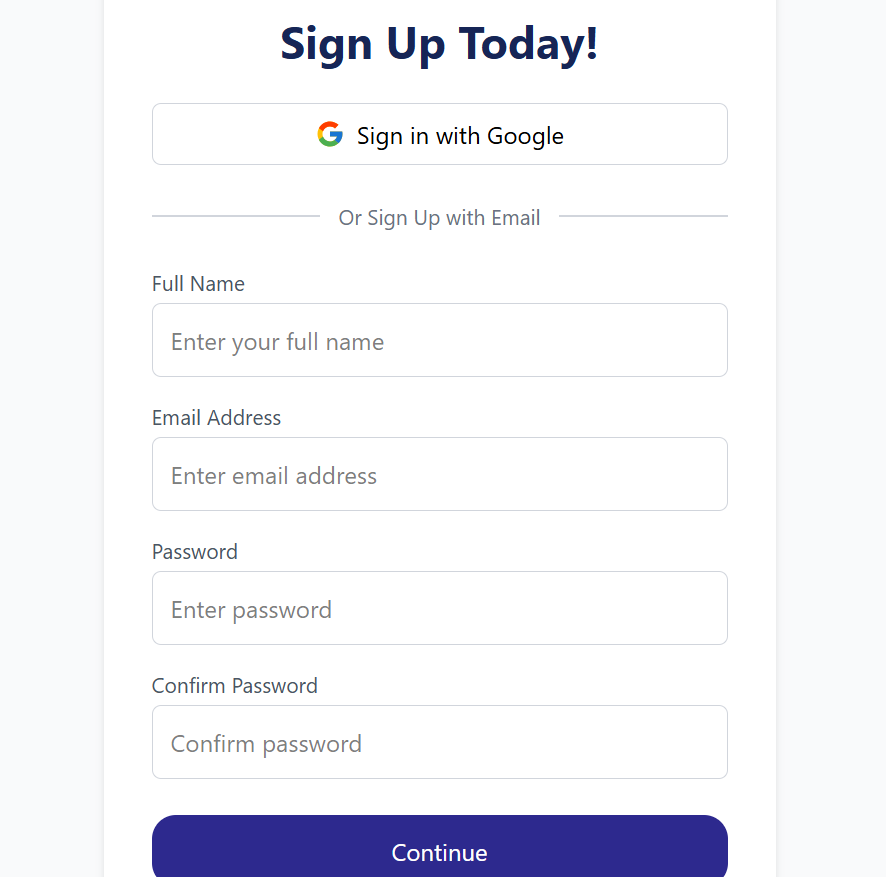
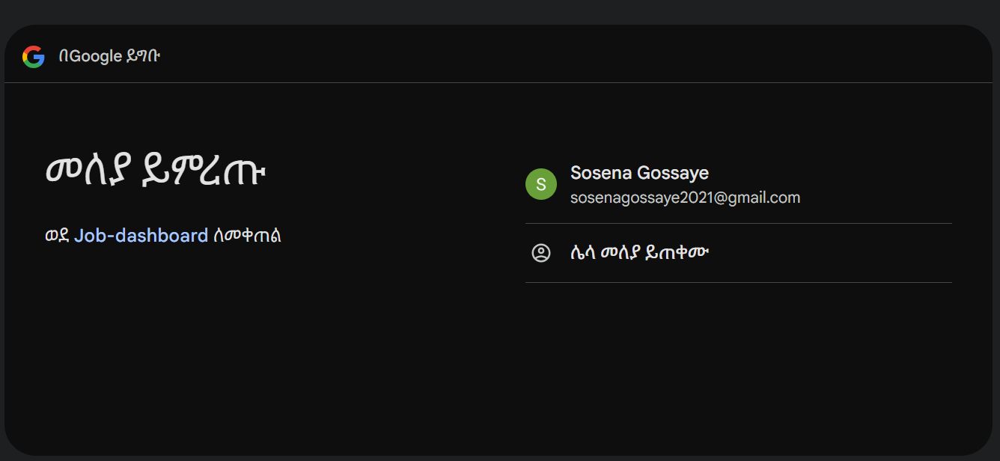
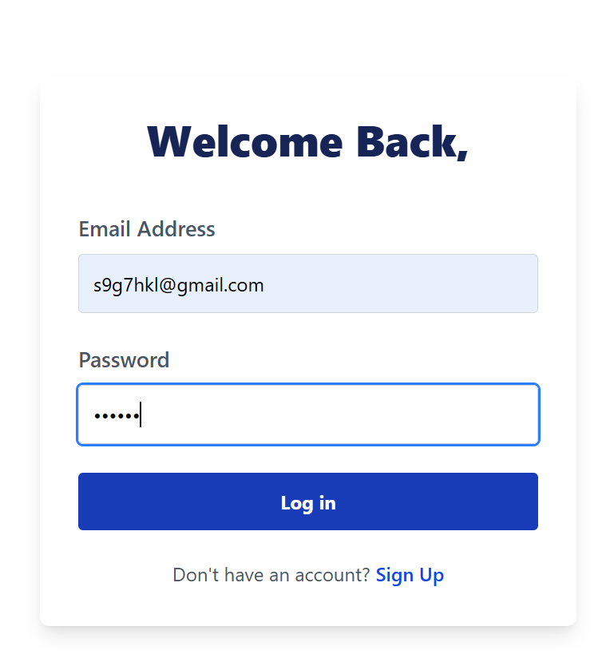
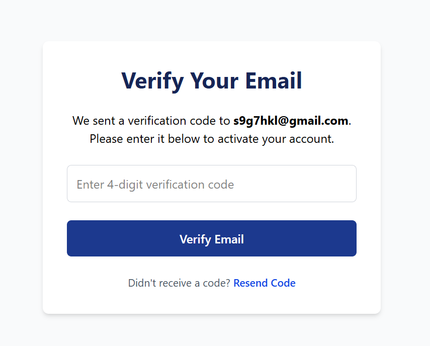
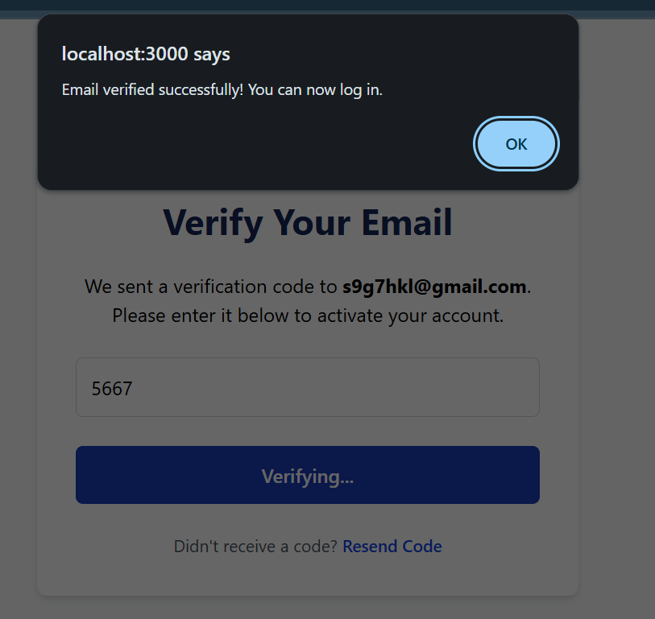

🔐 Next.js + TypeScript Authentication — Task 8
This is an authentication system built with Next.js, TypeScript, and NextAuth.js, using both custom credentials and Google OAuth for a Job-listing application. In this task, we implemented user sign-up and sign-in functionality and connected it to the provided backend API endpoints for real user authentication.

✅ Features
🔑 User Sign In & Sign Up — Custom pages for user registration and login.

🛂 NextAuth Integration — Secure authentication with Credentials & Google providers.

🧾 JWT & Session Handling — Manages secure session and token-based auth flow.

🌐 API Integration — Fully integrated with the backend for real-time auth.

⚠️ Error Handling — Graceful handling of invalid credentials or failed API requests.

⚙️ Technologies Used

    ⚛️ Next.js (App Router)

    🛠️ TypeScript

    💨 Tailwind CSS

    🔐 NextAuth.js

    🌐 Custom REST API for Auth

▶️ Getting Started

🧩 Prerequisites
Node.js and npm

    Git

🚀 Run the Project Locally

# Clone the repo

git clone https://github.com/sosena2/A2SV-web-track-projects.git

# Navigate into the task 8 folder

cd task-8/authentication-app

# Install dependencies

npm install

# Start the development server

npm run dev
Visit the app at: http://localhost:3000

📸 Screenshots
📝 Sign Up Page - custom signin

📝 Sign Up Page- google signup

📝 Signin page

⚙️ Email verification

